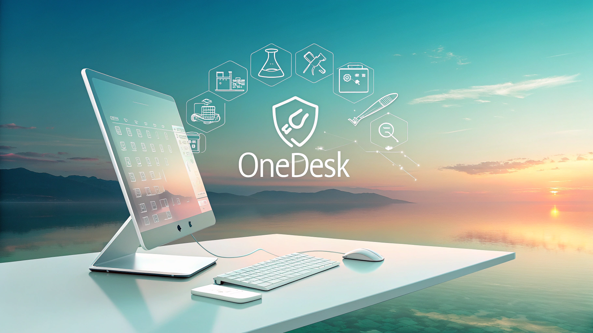

# OneDesk App by GANgsta's Paradise

A **single, unified desk** for every internal employee request: **Sick Leave, Education & Social Activities, Corporate Travel, Maintenance Issues, Internal Asset Booking, Expense Report**.



---

## Live Demo

https://gangstasparadise.team/

---

## Key Features

| Category               | What it gives you                                                |
| ---------------------- | ---------------------------------------------------------------- |
| Sick Leave             | Submit a sick‑leave request in two clicks                        |
| Education & Social     | Enrol in a course, join or create a team‑building event          |
| Corporate Travel       | Book flights, hotels and per‑diem for business trips             |
| Maintenance Issues     | Report a problem, attach a photo, track status                   |
| Internal Asset Booking | Reserve a company car, laptop, projector or any shared asset     |
| Expense Report         | Upload a receipt, enter the amount and get reimbursed in no time |

---

## Tech Stack

- **Next.js 14** (App Router, TypeScript)
- **Prisma** (ORM for database access)
- **Tailwind CSS + shadcn** for UI
- **Jest / Playwright** for tests
- **Railway** (Server, Postgres, Storage, CI/CD)

---

## Tools for Vibe Development

- **n8n.io** – No-code/low-code workflow automation, used for user request approval workflows with Human-in-the-loop (manager approval)
- **v0.dev** – Rapid UI prototyping and code generation from prompts
- **cursor.com** – AI-powered code editor for collaborative and efficient development
- **builder.io** – Visual headless CMS and page builder for fast content and UI iteration
- **uxpilot.ai** – AI-driven UX research and usability testing platform
- **gamma.app** – AI-powered presentation and document creation tool
- **refero.design** – Collaborative design feedback and review tool
- **manus.im** – AI assistant for product and design documentation
- **Azure OpenAI** – Advanced AI models and generative features for chat, code, and content

---

## Architecture

```mermaid
graph TB
    subgraph "Client Layer"
        UI[Next.js React UI]
        Dashboard[Unified Dashboard]
        Forms[Forms & Validation]
        style UI fill:#e1f5fe,stroke:#01579b
        style Auth fill:#e1f5fe,stroke:#01579b
        style Dashboard fill:#e1f5fe,stroke:#01579b
        style Forms fill:#e1f5fe,stroke:#01579b
    end

    subgraph "Application Layer"
        API[Next.js API Routes]
        WorkflowEngine[Workflow Engine]
        NotificationService[Notification Service]
        AIAssistant[AI Assistant]
        OCRService[OCR Service]
        style API fill:#e8f5e9,stroke:#2e7d32
        style WorkflowEngine fill:#e8f5e9,stroke:#2e7d32
        style NotificationService fill:#e8f5e9,stroke:#2e7d32
        style AIAssistant fill:#e8f5e9,stroke:#2e7d32
        style OCRService fill:#e8f5e9,stroke:#2e7d32
    end

    subgraph "Data Layer"
        DB[(PostgreSQL Database)]
        FileStorage[File Storage]
        Cache[Redis Cache]
        style DB fill:#fff3e0,stroke:#ef6c00
        style FileStorage fill:#fff3e0,stroke:#ef6c00
        style Cache fill:#fff3e0,stroke:#ef6c00
    end

    subgraph "Core Features"
        SickLeave[Sick Leave Management]
        Expenses[Expense Reporting]
        Maintenance[Maintenance Issues]
        Travel[Travel Management]
        Education[Education & Social]
        AssetBooking[Asset Booking]
        style SickLeave fill:#f3e5f5,stroke:#6a1b9a
        style Expenses fill:#f3e5f5,stroke:#6a1b9a
        style Maintenance fill:#f3e5f5,stroke:#6a1b9a
        style Travel fill:#f3e5f5,stroke:#6a1b9a
        style Education fill:#f3e5f5,stroke:#6a1b9a
        style AssetBooking fill:#f3e5f5,stroke:#6a1b9a
    end

    subgraph "External Services"
        EmailService[Email Service]
        n8n[n8n Automation]
        style EmailService fill:#fce4ec,stroke:#880e4f
        style n8n fill:#fce4ec,stroke:#880e4f
    end

    %% Client Layer Connections
    UI --> API
    Auth --> API
    Dashboard --> API
    Forms --> API

    %% Feature Connections
    Dashboard --> SickLeave
    Dashboard --> Expenses
    Dashboard --> Maintenance
    Dashboard --> Travel
    Dashboard --> Education
    Dashboard --> AssetBooking

    %% Application Layer Connections
    API --> WorkflowEngine
    API --> NotificationService
    API --> AIAssistant
    API --> OCRService

    %% Data Layer Connections
    WorkflowEngine --> DB
    API --> DB
    API --> FileStorage
    API --> Cache

    %% External Service Connections
    NotificationService --> EmailService
    WorkflowEngine --> n8n
    OCRService --> FileStorage
    AIAssistant --> OCRService

    %% Cache Connections
    Cache --> API

    %% Workflow Connections
    WorkflowEngine --> NotificationService
```



### Architecture Components Description

#### Client Layer

- **Next.js React UI**: Main frontend application using Next.js 15 App Router
- **Authentication**: User authentication and authorization system
- **Unified Dashboard**: Central dashboard for all features
- **Forms & Validation**: Form components with Zod validation

#### Application Layer

- **Next.js API Routes**: Backend API endpoints
- **Workflow Engine**: Business process automation
- **Notification Service**: Email and in-app notifications
- **AI Assistant**: AI-powered features and suggestions
- **OCR Service**: Receipt processing and text extraction
- **v0**: Fast UI prototyping and iteration

#### Data Layer

- **PostgreSQL Database**: Primary data storage
- **File Storage**: Document and image storage
- **Redis Cache**: Performance optimization caching

#### Core Features

- **Sick Leave Management**: Leave request and approval system
- **Expense Reporting**: Expense submission and processing
- **Maintenance Issues**: Issue tracking and resolution
- **Travel Management**: Travel request and booking
- **Education & Social**: Learning and social features
- **Asset Booking**: Resource reservation system

#### External Services

- **Email Service**: External email delivery service
- **n8n Automation**: Workflow automation platform, used for user request approval workflows with Human-in-the-loop (manager approval)

---

## Repository Layout

```
/README.md
/src             - Next.js application source code
/public          - Static assets
/assets          - Project assets and images
/prisma          - Database schema and migrations
/types           - TypeScript type definitions
/tests           - Test files and utilities
/__tests__       - Jest unit tests
/e2e             - Playwright end-to-end tests
/mocks           - Mock data for testing
/sql             - SQL queries and database scripts
/docs_new        - Documentation files
/n8n-workflows   - n8n workflow configurations
/.github/workflows - CI/CD pipelines
```

---

## Quick Start

### 1. Clone and install dependencies

```bash
git clone https://github.com/Levi9Hack9/gangstas_paradise_repo.git
cd gangstas_paradise_repo
pnpm install
```

### 2. Configure environment variables

### 3. Run locally

```bash
pnpm dev   # or turbo dev if using Turborepo
```

---

## NPM Scripts

| Command                   | Description                          |
| ------------------------- | ------------------------------------ |
| `npm run dev`             | Start the local dev server (Next.js) |
| `npm run build`           | Production build (Next.js)           |
| `npm run start`           | Start production server              |
| `npm run lint`            | Run ESLint                           |
| `npm run test`            | Run unit tests with Vitest           |
| `npm run test:watch`      | Run Vitest in watch mode             |
| `npm run test:ui`         | Run Vitest with UI                   |
| `npm run test:coverage`   | Run Vitest with coverage report      |
| `npm run test:e2e`        | Run end-to-end tests with Playwright |
| `npm run test:e2e:report` | Show Playwright E2E test report      |

## Team Music Video for vibe coding 👨‍💻

Fully generated by AI:
[](https://www.youtube.com/watch?v=8n1cWBNmPio)
Tools for video production:

- ChatGPT: Advanced AI assistant for generating detailed prompts, storyboards, and creative concepts for both image and video compositions, streamlining the ideation process and maximizing creative potential.
- Suno AI: State-of-the-art generative music platform, enabling the creation of original songs, soundtracks, and audio effects tailored to project needs, from style emulation to fully custom compositions.
- Google Veo 2: Next-generation video generation engine that transforms text prompts and creative directions into high-quality, AI-generated video sequences, supporting both prototyping and final asset creation.
- Adobe Premiere Pro: Industry-standard non-linear video editing software, used for assembling, refining, and enhancing video projects by integrating AI-generated assets, audio, and visual effects into polished final productions.

© 2025 GANgsta's Paradise ❤️ Hack9
