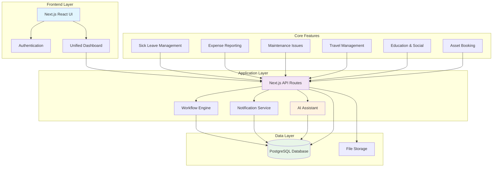

# Enterprise Workplace Hub - Overall Architecture

## App Name
**WorkHub Pro** - Enterprise Workplace Experience Platform

## App Description
A comprehensive enterprise web application that streamlines six essential workplace processes (sick leave, education/social activities, corporate travel, maintenance issues, asset booking, and expense reporting) into one unified, intuitive platform designed for modern enterprises.

## Project Pitch (30-second elevator pitch)
WorkHub Pro solves the administrative nightmare plaguing modern enterprises where employees waste hours navigating multiple disconnected systems for basic workplace needs. Our single, consumer-grade platform integrates six critical workplace functions—from sick leave to expense reporting—enabling seamless cross-feature workflows that traditional HR suites can't match. With remote work amplifying the need for digital-first solutions, we're targeting a $650+ billion enterprise software market where workplace experience is now a top retention factor.

## MVP Flow

A clear, step-by-step description of the **tightly-timed demo flow** (4-5 steps max):

1. **Quick intro** (15 seconds): "Employees waste 2+ hours weekly on workplace admin across disconnected systems—WorkHub Pro unifies six essential functions into one seamless experience"
2. **Core workflow demonstration** (30 seconds): Employee submits sick leave request through intuitive interface, showing approval workflow and calendar integration
3. **Cross-feature integration showcase** (30 seconds): Business travel booking that automatically generates expense categories and maintenance request for office setup
4. **Wow moment - AI-powered assistance** (30 seconds): AI assistant analyzes patterns to suggest optimal travel routes, predicts maintenance needs, and auto-categorizes expenses
5. **Feature coverage panorama** (15 seconds): Quick dashboard view showing all six modules working together with real-time notifications and analytics

**Demo Duration:** 2 minutes maximum (120 seconds total)
**Key constraint:** Must show multiple integrated features while maintaining smooth narrative flow

---

## Launch Features (Multi-Feature Strategy)

**Tier 1: Must Implement Fully (3-4 features with AI assistance for Functionality points)**

### Feature A: Sick Leave Management
_Core HR process that every enterprise needs with streamlined approval workflows_
Employee enters sick leave Management page, where they can see calendar and can choose range or day in the future to select desire sick leave period

* Requirement 1: Employee sick leave selection with calendar interface for future date/range selection (Complexity: High) - AI-accelerated
* Requirement 2: Manager email notification system with Accept/Decline buttons and status synchronization via n8n automation flow (Complexity: Medium) - Rapid implementation
* **Implementation:** Full working feature with AI code generation - employees see real-time status updates on Management page, managers receive complete request data (user name, email, dates) via email through n8n workflow automation, and status changes trigger automatic email notifications to employees using n8n automation flow

### Feature B: Expense Report Management 
_High-value feature with receipt scanning and auto-categorization_

**Overview:**
Enables employees to submit, categorize, and request approval for expenses incurred during work-related activities. Leverages OCR for receipt scanning and integrates with a manager approval workflow.

**Core Functionality:**

**Receipt Upload & OCR Processing**
* Implement a feature that allows a logged-in user to upload a photo of a receipt
* Once the image is uploaded:
  - Use OCR (Optical Character Recognition) to extract text from the image
  - Detect and extract the amount spent (in currency)
  - Use the receipt contents to propose a category from a predefined list
  - Show the extracted amount and proposed category to the user for review
  - Allow the user to correct the amount or choose a different category before submission

**Category Management**
* Displays the proposed category from the OCR logic
* Lets the user accept the suggested category or select another from the list
* If the user selects "Other", prompt them to provide a custom description
* **Expense Categories (predefined list):**
  - Travel
  - Accommodation
  - Meal / Dinner with customers
  - Team building expenses
  - Office supplies
  - Software & subscriptions
  - Training & education
  - Miscellaneous / Other

**Amount Verification**
* Display the recognized amount and allow the user to confirm or correct it
* Add a "Submit Expense Report" button that stores the reviewed data and initiates the approval process

**Approval Workflow**
* When an expense report is submitted, send a notification email to the user's manager with expense details (amount, category, receipt image)
* The manager can:
  - Approve the expense (mark as approved in the database)
  - Reject the expense and provide a rejection reason (mark as rejected, store the reason)
* Notify the user of the manager's decision by email and show the status in the expense report UI

**Technical Requirements**
* Ensure the system handles multiple currencies
* Use a background job or async processing for OCR to keep UI responsive
* Store all uploaded receipts securely and make them accessible via the report

* Requirement 1: Receipt upload with OCR text extraction, amount detection, and category suggestion system (Complexity: High) - v0 for UI
* Requirement 2: Manager approval workflow with email notifications and status tracking integration (Complexity: High) - Cursor AI for backend
* **Implementation:** Full working feature - employees upload receipt photos for automatic text extraction and smart categorization, managers receive detailed approval emails with receipt images, and the system provides real-time status updates with secure receipt storage and multi-currency support

### Feature C: Maintenance Issues Management
_Facility management feature that showcases issue reporting and tracking workflows_

**Purpose:**
Allow employees to quickly report and track facility-related issues while providing facility teams with a streamlined interface to manage, assign, and resolve maintenance requests efficiently.

**Functionality Overview:**

**Manual Issue Reporting Form**
* Users access a clean, intuitive form to report problems (device issue, reboot issue, etc.)
* Required fields:
- device type: show devices already assigned to user
  - Issue Type (dropdown)
  - Short Description (text field)
* Upon submission, the issue is added to the tracking system

**Status Tracking**
* Submitted issues appear in the "My Requests" table for the reporting user
* Statuses follow a clear workflow: New → Assigned → In Progress → Resolved
* Users can view status changes and facility team comments

**Notifications**
* Email sent when:
  - A ticket is assigned
  - Status is updated

* Requirement 1: Issue reporting form with dropdown categorization and tracking system integration (Complexity: Medium) - AI-accelerated
* Requirement 2: Status workflow management with automated email notifications for assignment and updates (Complexity: Medium) - Rapid implementation
* **Implementation:** Full working feature (AI-enabled ambitious scope) - employees submit issues through intuitive form, facility teams manage requests with clear status progression, and automated notifications keep all stakeholders informed throughout the resolution process

**Tier 2: Implement Partially (2-3 features with AI assistance for Feature Coverage points)**

### Feature D: Corporate Travel Management
_Complex feature showing integration potential with expense workflows_

#### Travel Request Form

**Goal:**
Enable employees to submit a structured request for a business trip, including travel preferences.

**Form Fields (Mandatory unless noted):**

* Title – A short name for the business trip.
* Description Section:
  * Destination (City, Country)
  * Customer / Project Name
  * Luggage Necessity (Yes / No)
  * Preferred Travel Time (e.g., morning, afternoon, or exact datetime)
* Business Trip Dates – Select start and end date via a calendar UI.
* Approving Manager – Select from a dropdown of eligible managers.

**Implementation:**

* AI-generated travel booking UI mockups (working interface)
* Basic itinerary creation with expense pre-population
* **Implementation Status:** 60-70% complete for demo points (AI-accelerated prototyping)

### Feature E: AI-Powered Workplace Assistant
_The innovative "wow factor" feature that distinguishes from traditional HR suites_
* Predictive analytics for maintenance scheduling and resource optimization
* Smart suggestions for travel routes and expense categorization
* **Implementation:** AI-generated concept demo + key working AI component

#### Tech Stack (Pre-configured + AI-Enhanced)
* Frontend: Next.js v15 App Router + React.js + TypeScript
* UI Components: shadcn/ui + Tailwind CSS
* Backend: Next.js API routes + TypeScript
* Database: PostgreSQL
* Deployment: Railway
* APIs/Services: [Pre-existing accounts only]

**AI Development Tools:**
* **v0:** Rapid UI component generation for complex workflows
* **UX Pilot:** Enterprise UX optimization and accessibility enhancement
* **Cursor AI:** AI-powered development for backend logic and database operations
* **Claude 4:** Architecture planning, complex business logic, documentation
* **GPT 4.1:** API integration, workflow automation, feature implementation
* **Gemini Pro 2.5:** AI assistant features and predictive analytics

#### Time Allocation (AI-Enhanced 6.5 hours development + 30min presentation)
* **Project setup:** 0 hours (already done)
* **Requirements analysis & AI tool planning:** 0.5 hours
* **Tier 1 features (3-4 full features with AI):** 3.5 hours  
* **Tier 2 features (1-2 partial with AI assistance):** 1.5 hours
* **Strategic testing (backend API tests only):** 0.5 hours (AI-assisted)
* **AI-generated documentation:** 0.25 hours (AI does heavy lifting)
* **AI-enhanced polish & integration:** 0.25 hours
* **Presentation prep:** 30 minutes separate

**AI Acceleration Strategy:**
Build 50-75% more features with same effort by leveraging AI for enterprise workflow generation, UI creation, business logic implementation, and comprehensive documentation

**Strategic Testing Approach (for 10% Test Coverage points):**
- Focus ONLY on backend API tests for core business workflows (AI can generate these effectively)
- Skip frontend component tests (too time-consuming even with AI)
- Target 2-3 core business logic functions (approval workflows, maintenance priority assignment, expense calculations)
- Use Jest for API routes, avoid complex React testing scenarios

---

## System Diagram

---

## Risk Assessment & Mitigation

### High Risk (could kill the project)
* **Database schema complexity for 6 features** → Start with 3 core tables (users, requests, maintenance_tickets), expand incrementally with AI-generated migrations
* **Cross-feature workflow integration complexity** → Build features independently first, add integration in final hour with pre-planned API contracts

### Medium Risk (could delay or reduce scope)  
* **AI assistant feature over-engineering** → Implement as simple rule-based suggestions first, add AI complexity only if time permits
* **File upload/OCR for expense receipts** → Use simple text input as fallback, implement file upload as enhancement if time allows

---

## Team Coordination Plan

### Development Phases (AI-Enhanced Team Strategy)
1. **Requirements & AI Planning** (Hour 0.5): [Product Owner + Claude 4 for architecture, assign specialized AI tools to each developer]
2. **AI-Accelerated Parallel Development** (Hours 0.5-4.5): [UI Dev with v0/UX Pilot for enterprise components, BE Dev with Cursor/GPT for workflow APIs, General Dev with multi-AI for basic features]
3. **AI-Powered Wow Feature** (Hours 1-5): [Wow Feature Dev using Gemini Pro 2.5 + Claude 4 for intelligent workplace assistant]
4. **AI-Assisted Integration Features** (Hours 4.5-5.5): [General Dev with AI code generation for cross-feature workflows]
5. **AI-Enhanced Integration** (Hours 5.5-6): [All devs use AI for debugging, workflow testing, performance optimization]
6. **Strategic Testing & AI Documentation** (Hour 5.5-6.25): [AI-generated backend tests for approval workflows, comprehensive enterprise docs]
7. **AI-Polished Demo Prep** (Hour 6.25-6.5): [UX Pilot for final enterprise polish, demo flow optimization]
8. **AI-Assisted Presentation** (30min separate): [Product Owner + AI for compelling enterprise sales narrative]

### Critical Checkpoints (AI-Enhanced Coordination)
* Hour 0.5: Core features prioritized, AI tools assigned, workplace assistant AI strategy defined
* Hour 2: Sick leave + expense features working (AI acceleration), AI assistant concept validated
* Hour 4.5: 3 Tier 1 features complete (AI-enhanced), cross-feature integrations mapped
* Hour 5.5: Maintenance + travel features prototyped with AI, AI assistant partially integrated
* Hour 6: All core workflows integrated, AI-assisted enterprise testing complete
* Hour 6.25: Strategic API tests complete, AI-generated enterprise documentation ready
* Hour 6.5: AI-polished enterprise UI/UX, 2-minute sales demo perfected
* +30min: AI-enhanced enterprise presentation ready for decision-makers

---

## Scoring Optimization Plan

### Easy Points (30% total - prioritize these with AI!)
**Documentation (10%):**
- Professional enterprise README with clear business value sections
- Installation/deployment instructions for enterprise environments
- Feature explanations with ROI justifications
- Mermaid.js enterprise architecture diagram
- **Time needed:** 5-10 minutes (AI-generated based on implemented features)

**Test Coverage (10%):**
- **Strategic approach:** Focus on backend API tests for core business workflows
- AI-generated unit tests for approval workflows, maintenance priority assignment, expense calculations
- Basic coverage reporting setup with enterprise-grade metrics
- **Skip frontend component tests** (too time-consuming even with AI)
- **Time needed:** 30-40 minutes (realistic AI-assisted approach)

**Project Board (10%):**
- GitHub Projects with enterprise feature breakdown
- Clear user story tracking with business value metrics
- Progress tracking with AI-enhanced organization and reporting
- **Time needed:** 10 minutes setup + AI-optimized ongoing updates

### Core Points (40% total - must execute well)
**Feature Coverage (20%):**
- Plan 6 enterprise features in project board
- Implement 3 fully working (sick leave, expenses, maintenance)
- Show 2-3 partially (travel, AI assistant, education/asset booking)

**Functionality (20%):**
- Zero major bugs in core approval workflows
- Smooth enterprise demo flow showcasing real business value
- All demonstrated features work reliably under demo conditions

### Differentiator Points (30% total - win factor)
**Vibe (20%):**
- Innovative AI-powered workplace assistant approach
- Cross-feature workflow integration that competitors lack
- Bold vision for unified enterprise workplace experience
- Memorable "single platform" value proposition

**UX/UI (10%):**
- Professional, enterprise-grade design consistency
- Intuitive workflows that reduce administrative friction
- Accessibility considerations for diverse enterprise users 