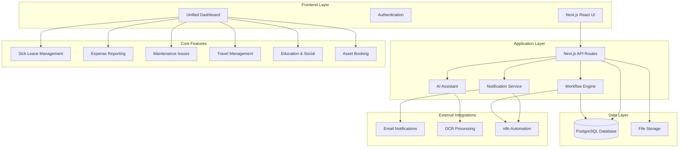

# WorkHub Pro - Hackathon Technical Specifications

## App Overview

**WorkHub Pro** - Enterprise Workplace Experience Platform

A comprehensive enterprise web application that streamlines six essential workplace processes (sick leave, education/social activities, corporate travel, maintenance issues, asset booking, and expense reporting) into one unified, intuitive platform designed for modern enterprises.

## MVP Demo Flow

A clear, step-by-step description of the **tightly-timed demo flow** (4-5 steps max):

1. **Quick intro** (15 seconds): "Employees waste 2+ hours weekly on workplace admin across disconnected systems—WorkHub Pro unifies six essential functions into one seamless experience"
2. **Core workflow demonstration** (30 seconds): Employee submits sick leave request through intuitive interface, showing approval workflow and calendar integration
3. **Cross-feature integration showcase** (30 seconds): Business travel booking that automatically generates expense categories and maintenance request for office setup
4. **Wow moment - AI-powered assistance** (30 seconds): AI assistant analyzes patterns to suggest optimal travel routes, predicts maintenance needs, and auto-categorizes expenses
5. **Feature coverage panorama** (15 seconds): Quick dashboard view showing all six modules working together with real-time notifications and analytics

**Demo Duration:** 2 minutes maximum (120 seconds total)

**Key constraint:** Must show multiple integrated features while maintaining smooth narrative flow

## Architecture Overview

**Hackathon-Optimized Tech Stack:**

- **Frontend:** Next.js v15 App Router + React + TypeScript
- **UI Framework:** shadcn/ui components + Tailwind CSS
- **Backend:** Next.js API routes + TypeScript
- **Database:** PostgreSQL with optimized schema for rapid development
- **Deployment:** Railway (pre-configured for live demo)
- **AI Acceleration:** Integrated development strategy for each team member

**AI Development Tools:**

- **v0:** Rapid UI component generation for complex workflows
- **UX Pilot:** Enterprise UX optimization and accessibility enhancement
- **Cursor AI:** AI-powered development for backend logic and database operations
- **Claude 4:** Architecture planning, complex business logic, documentation
- **GPT 4.1:** API integration, workflow automation, feature implementation
- **Gemini Pro 2.5:** AI assistant features and predictive analytics

**System Architecture Diagram:**



**Deployment Strategy:**

- **Railway Configuration:** Environment variables for database connection, email service API keys, OCR service credentials
- **Demo Reliability:** Pre-loaded demo data, optimized database queries, graceful error handling
- **Live Demo Requirements:** Fast loading dashboard, responsive UI components, backup demo scenarios
- **Performance Optimization:** Image optimization for receipts, efficient database indexing, API route caching

## Database Schema Design

### Core Tables (Required for Tier 1 Features)

```sql
-- Users table for authentication and basic info
CREATE TABLE users (
  id SERIAL PRIMARY KEY,
  email VARCHAR(255) UNIQUE NOT NULL,
  name VARCHAR(255) NOT NULL,
  role VARCHAR(50) DEFAULT 'employee',
  manager_id INTEGER REFERENCES users(id),
  created_at TIMESTAMP DEFAULT NOW(),
  updated_at TIMESTAMP DEFAULT NOW()
);

-- Sick Leave Management
CREATE TABLE sick_leave_requests (
  id SERIAL PRIMARY KEY,
  user_id INTEGER REFERENCES users(id) NOT NULL,
  start_date DATE NOT NULL,
  end_date DATE NOT NULL,
  status VARCHAR(50) DEFAULT 'pending',
  manager_comments TEXT,
  created_at TIMESTAMP DEFAULT NOW(),
  updated_at TIMESTAMP DEFAULT NOW()
);

-- Expense Reports
CREATE TABLE expense_reports (
  id SERIAL PRIMARY KEY,
  user_id INTEGER REFERENCES users(id) NOT NULL,
  amount DECIMAL(10,2) NOT NULL,
  currency VARCHAR(3) DEFAULT 'USD',
  category VARCHAR(100) NOT NULL,
  description TEXT,
  receipt_url VARCHAR(500),
  ocr_data JSONB,
  status VARCHAR(50) DEFAULT 'pending',
  manager_comments TEXT,
  created_at TIMESTAMP DEFAULT NOW(),
  updated_at TIMESTAMP DEFAULT NOW()
);

-- Maintenance Issues
CREATE TABLE maintenance_issues (
  id SERIAL PRIMARY KEY,
  user_id INTEGER REFERENCES users(id) NOT NULL,
  issue_type VARCHAR(100) NOT NULL,
  description TEXT NOT NULL,
  device_serial_number VARCHAR(255),
  status VARCHAR(50) DEFAULT 'new',
  assigned_to INTEGER REFERENCES users(id),
  priority VARCHAR(20) DEFAULT 'medium',
  comments TEXT,
  created_at TIMESTAMP DEFAULT NOW(),
  updated_at TIMESTAMP DEFAULT NOW()
);

-- Devices for maintenance tracking
CREATE TABLE devices (
  id SERIAL PRIMARY KEY,
  serial_number VARCHAR(255) UNIQUE NOT NULL,
  type VARCHAR(100) NOT NULL,
  model VARCHAR(255),
  location VARCHAR(255),
  purchase_date DATE,
  warranty_expiry DATE,
  status VARCHAR(50) DEFAULT 'active',
  created_at TIMESTAMP DEFAULT NOW(),
  updated_at TIMESTAMP DEFAULT NOW()
);

-- Indexes for demo performance
CREATE INDEX idx_sick_leave_user_id ON sick_leave_requests(user_id);
CREATE INDEX idx_sick_leave_status ON sick_leave_requests(status);
CREATE INDEX idx_expense_reports_user_id ON expense_reports(user_id);
CREATE INDEX idx_expense_reports_status ON expense_reports(status);
CREATE INDEX idx_maintenance_issues_user_id ON maintenance_issues(user_id);
CREATE INDEX idx_maintenance_issues_status ON maintenance_issues(status);
CREATE INDEX idx_devices_type ON devices(type);
CREATE INDEX idx_devices_status ON devices(status);
```

### Supporting Tables (Tier 2 Feature Support)

```sql
-- Corporate Travel (Tier 2)
CREATE TABLE travel_requests (
  id SERIAL PRIMARY KEY,
  user_id INTEGER REFERENCES users(id) NOT NULL,
  destination VARCHAR(255) NOT NULL,
  departure_date DATE NOT NULL,
  return_date DATE NOT NULL,
  purpose TEXT,
  status VARCHAR(50) DEFAULT 'draft',
  estimated_cost DECIMAL(10,2),
  created_at TIMESTAMP DEFAULT NOW(),
  updated_at TIMESTAMP DEFAULT NOW()
);

-- Asset Booking (Tier 2)
CREATE TABLE assets (
  id SERIAL PRIMARY KEY,
  name VARCHAR(255) NOT NULL,
  type VARCHAR(100) NOT NULL,
  available BOOLEAN DEFAULT true,
  created_at TIMESTAMP DEFAULT NOW()
);

CREATE TABLE asset_bookings (
  id SERIAL PRIMARY KEY,
  user_id INTEGER REFERENCES users(id) NOT NULL,
  asset_id INTEGER REFERENCES assets(id) NOT NULL,
  start_date DATE NOT NULL,
  end_date DATE NOT NULL,
  status VARCHAR(50) DEFAULT 'active',
  created_at TIMESTAMP DEFAULT NOW()
);
```

**Migration Strategy:**

- **Development Phase:** Single migration file for rapid setup with all core tables
- **Demo Data:** Seed script with realistic sample data including test users, pending requests, and various statuses
- **Performance:** Optimized indexes for fast demo queries and responsive UI

## Multi-Tier Feature Specifications

### Tier 1 Features (Must Implement Fully - 3-4 features)

#### Feature 1: Sick Leave Management

**Implementation Priority:** CRITICAL - Must be flawless for demo
**AI Tool Assignment:** UI Developer (v0) + BE Developer (Cursor AI) collaboration
**Demo Timing:** 30 seconds allocation in 2-minute flow

##### Technical Requirements

**Goal:** Streamlined sick leave submission with intuitive calendar interface and automated manager approval workflow that demonstrates enterprise-grade HR process digitization

**API Design (Next.js App Router):**

```typescript
// app/api/sick-leave/route.ts
GET /api/sick-leave
- Purpose: Retrieve user's sick leave requests with status tracking
- Request: Query params for user filtering and date ranges
- Response: Array of sick leave requests with status, dates, manager comments
- AI Implementation: Cursor AI + GPT 4.1 code generation for query optimization

POST /api/sick-leave
- Purpose: Submit new sick leave request with date validation
- Validation: Zod schema for date range validation, future date requirements
- Error Handling: Comprehensive validation errors, date conflicts, server errors with user-friendly messages
- AI Implementation: Backend-focused AI assistance for business logic

PUT /api/sick-leave/[id]/approve
- Purpose: Manager approval/rejection with automated email triggers
- Request: Status update with optional manager comments
- Response: Updated request status with email notification confirmation
- AI Implementation: n8n integration for email automation workflow
```

**Frontend Implementation (Next.js App Router):**

```typescript
// app/sick-leave/page.tsx
Page Component Hierarchy:
├── SickLeavePage (main container with dashboard integration)
├── SickLeaveHeader (title, stats, quick actions)
├── CalendarSelector (shadcn/ui calendar for date range selection)
├── RequestForm (form with validation and submission)
├── RequestsList (table of existing requests with status badges)
└── LoadingStates (skeleton components for demo polish)

State Management:
- React hooks for calendar state and form management
- API integration with optimistic updates for smooth UX
- Loading states with shadcn/ui skeleton components
- Error boundaries for demo reliability

AI Implementation Strategy:
- v0 for calendar component generation and form layouts
- UX Pilot for enterprise UX optimization and accessibility
- Cursor AI for TypeScript implementation and API integration
```

**Database Operations:**

```sql
-- Core CRUD operations optimized for demo
SELECT queries: JOIN with users table for manager info, status filtering
INSERT operations: Date validation, future date requirements
UPDATE operations: Status changes with timestamp tracking
DELETE strategy: Soft delete with status change for demo safety
```

**Demo Flow Integration:**

- **Entry Point:** Dashboard tile showing pending requests count
- **Key Interactions:** 
  1. Click calendar to select date range (visual feedback)
  2. Submit request (immediate success feedback)
  3. View updated status in requests table
- **Success Indicators:** Status badges, confirmation toasts, email notification preview
- **Error Recovery:** Graceful validation errors with clear messaging
- **Transition Out:** Seamless navigation to expense reports feature

**AI-Enhanced Implementation Guide:**

1. **v0 Component Generation:** Calendar interface with date range selection and validation
2. **Cursor AI Backend:** API routes with PostgreSQL integration and business logic
3. **UX Pilot Optimization:** Enterprise accessibility standards and responsive design
4. **Integration Testing:** AI-assisted API testing with realistic scenarios

##### Screen-Level Technical Specifications

###### Screen 1.1: Sick Leave Management Dashboard

**Technical Integration with Design Brief:** Clean enterprise interface with shadcn/ui components

**Component Architecture:**

```typescript
interface SickLeavePageProps {
  user: User;
  existingRequests: SickLeaveRequest[];
}

Component Structure:
├── shadcn/ui Card components for request summaries
├── Calendar component with date range selection
├── Form handling with react-hook-form and Zod validation
├── Table component for request history with status badges
├── Loading states with skeleton components
└── Toast notifications for success/error feedback
```

**API Integration:**

- **Endpoint Usage:** GET /api/sick-leave for user requests, POST for submissions
- **Data Flow:** Calendar selection → Form validation → API submission → UI update
- **Error Handling:** Validation errors, date conflicts, server errors with user-friendly messages
- **Performance:** Optimistic updates for immediate feedback, efficient data fetching

**State Management:**

```typescript
interface SickLeaveState {
  loading: boolean;
  requests: SickLeaveRequest[];
  selectedDates: { start: Date; end: Date } | null;
  submitting: boolean;
  error: string | null;
}
```

#### Feature 2: Expense Report Management

**Implementation Priority:** CRITICAL - High-value feature demonstrating AI integration
**AI Tool Assignment:** Wow Feature Developer (Gemini Pro 2.5) + BE Developer (GPT 4.1)
**Demo Timing:** 45 seconds allocation - showcases AI capabilities

##### Technical Requirements

**Goal:** OCR-powered receipt processing with smart categorization and automated approval workflow that demonstrates cutting-edge AI integration in enterprise expense management

**API Design (Next.js App Router):**

```typescript
// app/api/expenses/route.ts
GET /api/expenses
- Purpose: Retrieve user's expense reports with receipt URLs and status
- Request: Query params for filtering by status, date range, category
- Response: Expense reports with OCR data, receipt images, approval status
- AI Implementation: Efficient query optimization with GPT 4.1

POST /api/expenses
- Purpose: Create expense with OCR processing and auto-categorization
- Validation: File upload validation, amount formatting, category selection
- Error Handling: OCR failures, file size limits, processing timeouts
- AI Implementation: Gemini Pro 2.5 for OCR integration and smart categorization

POST /api/expenses/upload-receipt
- Purpose: Handle receipt image upload with OCR processing
- Request: Multipart form data with image file
- Response: Extracted text, detected amount, suggested category
- AI Implementation: OCR service integration with error handling

PUT /api/expenses/[id]/approve
- Purpose: Manager approval/rejection with automated email triggers
- Request: Status update ('approved'/'rejected') with optional manager comments
- Response: Updated expense report status with email notification confirmation
- Validation: Manager authorization, expense ownership verification
- AI Implementation: n8n integration for email automation workflow
```

**Frontend Implementation (Next.js App Router):**

```typescript
// app/expenses/page.tsx
Page Component Hierarchy:
├── ExpensePage (main container with upload functionality)
├── ReceiptUpload (drag-and-drop with image preview)
├── OCRResults (extracted amount and category display)
├── ExpenseForm (editable form with category dropdown)
├── ExpensesList (table with receipt thumbnails and status)
└── ApprovalWorkflow (manager view with approve/reject actions)

State Management:
- File upload state with progress indicators
- OCR processing state with loading animations
- Form state with validation and submission handling
- Optimistic updates for smooth user experience

AI Implementation Strategy:
- v0 for upload interface and form components
- Gemini Pro 2.5 for OCR processing and smart categorization
- UX Pilot for file upload UX optimization
- Cursor AI for backend API integration
```

**OCR Integration Architecture:**

```typescript
// OCR Processing Pipeline
interface OCRPipeline {
  imageUpload: (file: File) => Promise<string>; // Upload to storage
  textExtraction: (imageUrl: string) => Promise<string>; // OCR processing
  amountDetection: (text: string) => Promise<number>; // AI amount parsing
  categoryPrediction: (text: string) => Promise<string>; // AI categorization
}

// Predefined Categories
const EXPENSE_CATEGORIES = [
  'Travel', 'Accommodation', 'Meals & Entertainment',
  'Office Supplies', 'Software & Subscriptions',
  'Training & Education', 'Team Building', 'Other'
];
```

**Demo Flow Integration:**

- **Entry Point:** Dashboard expense tile with upload prompt
- **Key Interactions:** 
  1. Drag and drop receipt image (visual upload feedback)
  2. Watch AI extract amount and suggest category (wow moment)
  3. Review and submit expense (seamless flow)
  4. Show manager approval notification and status update
- **Success Indicators:** OCR confidence scores, category suggestions, approval status badges
- **Error Recovery:** OCR retry options, manual entry fallback, approval workflow errors
- **Transition Out:** Navigate to maintenance issues feature

#### Feature 3: Maintenance Issues Management

**Implementation Priority:** CRITICAL - Demonstrates workflow automation
**AI Tool Assignment:** BE Developer (Cursor AI) + General Developer
**Demo Timing:** 30 seconds allocation in 2-minute flow

##### Technical Requirements

**Goal:** Streamlined facility issue reporting with automated assignment workflow and real-time status tracking that showcases enterprise facility management digitization

**API Design (Next.js App Router):**

```typescript
// app/api/maintenance/route.ts
GET /api/maintenance
- Purpose: Retrieve user's maintenance requests with status and assignment info
- Request: Query params for status filtering, priority sorting
- Response: Issues with assignee details, status history, comments
- AI Implementation: Cursor AI for optimized queries and status tracking

POST /api/maintenance
- Purpose: Submit new maintenance issue with auto-assignment logic
- Validation: Issue type validation, description requirements
- Error Handling: Assignment failures, notification errors
- AI Implementation: Automated assignment based on issue type and workload

PUT /api/maintenance/[id]/status
- Purpose: Update issue status with automated notifications
- Request: Status change with optional comments
- Response: Updated issue with notification confirmation
- AI Implementation: Email automation for status change notifications
```

**Frontend Implementation (Next.js App Router):**

```typescript
// app/maintenance/page.tsx
Page Component Hierarchy:
├── MaintenancePage (dashboard with issue statistics)
├── IssueReportForm (dropdown for issue types, description field)
├── IssuesList (table with status badges and priority indicators)
├── StatusTracker (visual workflow progress indicator)
├── CommentThread (communication history with facility team)
└── NotificationPanel (real-time status updates)

State Management:
- Form state for issue submission
- Real-time updates for status changes
- Comment thread management
- Loading states for all interactions

AI Implementation Strategy:
- v0 for form generation and status visualization
- Cursor AI for backend workflow automation
- UX Pilot for facility management UX optimization
```

**Issue Types and Workflow:**

```typescript
// Issue categorization for auto-assignment
const ISSUE_TYPES = [
  'IT Equipment', 'HVAC', 'Electrical', 'Plumbing',
  'Security', 'Cleaning', 'Office Furniture', 'General'
];

// Status workflow
const STATUS_WORKFLOW = {
  'new': 'Submitted - Awaiting Assignment',
  'assigned': 'Assigned to Facility Team',
  'in_progress': 'Work in Progress',
  'resolved': 'Issue Resolved'
};
```

**Demo Flow Integration:**

- **Entry Point:** Quick "Report Issue" button on dashboard
- **Key Interactions:** 
  1. Select issue type from dropdown (immediate validation)
  2. Enter description and submit (auto-assignment demonstration)
  3. View real-time status update (workflow automation)
- **Success Indicators:** Assignment notification, status progression, estimated resolution time
- **Error Recovery:** Form validation errors, assignment retry logic
- **Transition Out:** Dashboard overview showing all features integration

### Tier 2 Features (Partial Implementation - 1-2 features)

#### Feature 4: Corporate Travel Management

**Implementation Priority:** MEDIUM - Show vision and ambition for Feature Coverage points
**AI Tool Assignment:** General Developer + v0 for rapid UI generation
**Demo Timing:** 15 seconds allocation for impressive vision showcase

##### Strategic Implementation Approach

**Goal:** Demonstrate technical ambition for comprehensive travel booking with expense integration

**AI-Generated UI Strategy:**

```typescript
// v0-generated components with travel booking workflow
Components Needed:
├── TravelRequestForm (destination, dates, purpose, budget)
├── ItineraryBuilder (flight preferences, accommodation needs)
├── ExpensePrePopulation (automatic expense categories based on travel)
├── ApprovalWorkflow (manager approval with budget validation)
└── IntegrationShowcase (demonstrate connection with expense reports)
```

**Minimal Backend Support:**

```typescript
// app/api/travel/route.ts
GET /api/travel - Basic travel requests retrieval
POST /api/travel - Travel request submission with expense integration
// Focus on impressive frontend with minimal backend complexity
```

**Demo Integration:**

- **Quick Showcase:** Travel booking form with automatic expense category generation
- **Key Message:** Demonstrates platform integration capabilities and enterprise workflow vision
- **Technical Soundness:** Ensure form validation works and doesn't break during demo

#### Feature 5: AI-Powered Workplace Assistant (Wow Factor)

**Implementation Priority:** CRITICAL for Vibe scoring (20% of total points)
**AI Tool Assignment:** Wow Feature Developer + Gemini Pro 2.5 + Claude 4
**Demo Timing:** 30-45 seconds - The centerpiece moment

##### Innovation Technical Architecture

**Goal:** Create memorable AI-powered insights that demonstrate cutting-edge workplace optimization

**AI Integration Strategy:**

```typescript
// Innovative AI-powered functionality
AI Enhancement Approach:
├── PredictiveAnalytics (maintenance scheduling predictions)
├── SmartSuggestions (expense categorization, travel optimization)
├── WorkplaceInsights (usage patterns, cost optimization)
├── AutomatedAssignments (intelligent task routing)
└── DemoShowcase (real-time AI processing visualization)
```

**Technical Innovation Points:**

- **AI API Integration:** Real-time expense categorization confidence scores
- **Creative Implementation:** Predictive maintenance scheduling based on historical data
- **Technical Complexity:** Machine learning models for expense pattern analysis
- **User Experience:** Intuitive AI suggestions with explanation tooltips

**Demo Optimization:**

- **Wow Moment Setup:** "Watch our AI analyze this receipt and predict optimal categories"
- **Key Demonstration:** Live OCR processing with confidence scores and smart suggestions
- **Judge Impact:** Demonstrates genuine AI integration beyond basic CRUD operations

## Strategic Testing Approach (10% of total score)

**AI-Assisted Backend Testing Strategy:**

Focus ONLY on backend API tests for maximum ROI within time constraints.

### Test Coverage Plan

```typescript
// Target: Core API endpoints for coverage statistics
Test Priorities:
1. /api/sick-leave (CRUD operations and validation)
2. /api/expenses (OCR integration, file upload, and approval workflow)
3. /api/maintenance (workflow automation and status updates)

AI Implementation:
- Jest + Supertest for API testing
- AI-generated test cases using GPT 4.1
- Coverage reporting for scoring demonstration
```

### Test Implementation Guide

```typescript
// Example test structure (AI-generated)
describe('API Route: /api/sick-leave', () => {
  test('should create sick leave request with valid data', async () => {
    const response = await request(app)
      .post('/api/sick-leave')
      .send({
        start_date: '2024-02-01',
        end_date: '2024-02-03',
        user_id: 1
      });
    expect(response.status).toBe(201);
    expect(response.body.status).toBe('pending');
  });

  test('should validate future dates only', async () => {
    const response = await request(app)
      .post('/api/sick-leave')
      .send({
        start_date: '2024-01-01', // Past date
        end_date: '2024-01-02',
        user_id: 1
      });
    expect(response.status).toBe(400);
    expect(response.body.error).toContain('future date');
  });

  test('should handle manager approval workflow', async () => {
    const response = await request(app)
      .put('/api/sick-leave/1/approve')
      .send({
        status: 'approved',
        manager_comments: 'Approved for recovery'
      });
    expect(response.status).toBe(200);
    expect(response.body.status).toBe('approved');
  });
});

describe('API Route: /api/expenses', () => {
  test('should process receipt upload with OCR', async () => {
    const response = await request(app)
      .post('/api/expenses/upload-receipt')
      .attach('receipt', 'test-receipt.jpg');
    expect(response.status).toBe(200);
    expect(response.body).toHaveProperty('extracted_amount');
    expect(response.body).toHaveProperty('suggested_category');
  });

  test('should handle OCR failures gracefully', async () => {
    const response = await request(app)
      .post('/api/expenses/upload-receipt')
      .attach('receipt', 'invalid-file.txt');
    expect(response.status).toBe(400);
    expect(response.body.error).toContain('invalid file type');
  });

  test('should handle manager expense approval workflow', async () => {
    const response = await request(app)
      .put('/api/expenses/1/approve')
      .send({
        status: 'approved',
        manager_comments: 'Expense approved for reimbursement'
      });
    expect(response.status).toBe(200);
    expect(response.body.status).toBe('approved');
  });

  test('should validate manager authorization for expense approvals', async () => {
    const response = await request(app)
      .put('/api/expenses/1/approve')
      .set('Authorization', 'Bearer employee-token') // Non-manager token
      .send({
        status: 'approved'
      });
    expect(response.status).toBe(403);
    expect(response.body.error).toContain('insufficient privileges');
  });
});

describe('API Route: /api/maintenance', () => {
  test('should create maintenance issue with auto-assignment', async () => {
    const response = await request(app)
      .post('/api/maintenance')
      .send({
        issue_type: 'IT Equipment',
        description: 'Laptop keyboard not working',
        device_serial_number: 'LT001234'
      });
    expect(response.status).toBe(201);
    expect(response.body.status).toBe('new');
    expect(response.body).toHaveProperty('assigned_to');
  });
});
```

**Skip Complex Testing:**

- No frontend component testing (too time-intensive)
- No E2E testing (focus on backend coverage)
- No integration testing beyond API routes

## Performance Optimization for Live Demo

### Critical Performance Requirements

**Loading Time Targets:**

- Initial dashboard load: <2 seconds
- API responses: <500ms
- File upload processing: <3 seconds
- Database queries: <200ms for demo data volume

### Optimization Strategy

```typescript
// Next.js App Router optimization
Performance Techniques:
├── API route optimization (indexed queries, connection pooling)
├── Image optimization (receipt thumbnails, compressed uploads)
├── Component lazy loading (only for non-critical features)
├── Database query optimization (EXPLAIN plans, proper indexing)
└── Railway deployment optimization (build caching, environment variables)

// Critical optimizations for demo
Database Optimizations:
- Indexed foreign keys for fast JOINs
- Pagination for large data sets
- Connection pooling for concurrent requests
- Query result caching for repeated requests

Frontend Optimizations:
- shadcn/ui components for consistent performance
- Image lazy loading for receipt galleries
- Optimistic updates for instant feedback
- Error boundaries for graceful failure handling
```

## Team Coordination Technical Specifications

### Parallel Development Strategy

**Conflict Prevention:**

```typescript
// Clear module boundaries for parallel development
Team Member Assignments:
├── UI Developer: 
   - app/sick-leave/page.tsx + components
   - app/expenses/page.tsx + upload components
   - app/maintenance/page.tsx + form components
   - shadcn/ui component customization

├── BE Developer: 
   - app/api/sick-leave/route.ts + approval workflow
   - app/api/expenses/route.ts + OCR integration + approval workflow
   - app/api/maintenance/route.ts + assignment logic
   - Database schema and migrations

├── Wow Feature Developer: 
   - AI assistant components and logic
   - OCR service integration
   - Predictive analytics features
   - Innovation showcase components

├── General Developer: 
   - Tier 2 features (travel, asset booking)
   - Utility functions and shared components
   - Backend API testing suite
   - Integration helpers

└── Product Owner: 
   - Documentation generation coordination
   - Railway deployment configuration
   - Demo data preparation and testing
   - Cross-feature integration verification
```

### Demo Reliability Checklist

- [ ] All Tier 1 features working on deployed Railway application
- [ ] Demo data populated with realistic scenarios (pending approvals, resolved issues)
- [ ] Error handling graceful across all features (validation errors, server errors)
- [ ] Performance optimized for live demonstration (fast loading, responsive UI)
- [ ] Navigation flow tested for 2-minute presentation timeline
- [ ] OCR functionality working with test receipt images
- [ ] Email notifications configured and tested (demo-safe email addresses)
- [ ] Manager approval workflows functioning for both sick leave and expenses
- [ ] AI assistant features responding correctly
- [ ] Backup demo scenarios prepared for potential technical issues

### Pre-Demo Technical Verification

```bash
# Technical checklist for demo readiness
1. All API routes responding correctly (200 status codes)
   curl -X GET https://workhub-pro.railway.app/api/sick-leave
   curl -X GET https://workhub-pro.railway.app/api/expenses
   curl -X GET https://workhub-pro.railway.app/api/maintenance

2. Manager approval workflows functioning
   - Test sick leave approval/rejection
   - Test expense approval/rejection
   - Verify email notifications trigger correctly

3. Database operations working reliably
   - Test user authentication flow
   - Verify data persistence across features
   - Check demo data integrity

4. UI components rendering properly across features
   - Sick leave calendar functionality
   - Expense upload and OCR processing
   - Maintenance issue form submission
   - Manager approval interfaces

5. Demo flow navigation smooth and intuitive
   - Dashboard → Sick Leave → Expenses → Maintenance → Dashboard
   - All transitions under 2 seconds
   - No broken links or error states

6. Performance meeting target metrics
   - Lighthouse performance score >90
   - API response times <500ms
   - Image upload processing <3 seconds

7. Error states handled gracefully
   - Network connectivity issues
   - File upload failures
   - Validation error messaging
   - Server error recovery
```

This technical specification provides the foundation for a successful 6.5-hour hackathon implementation, leveraging AI tools for maximum development acceleration while ensuring all scoring categories are addressed through strategic feature prioritization and robust technical architecture.