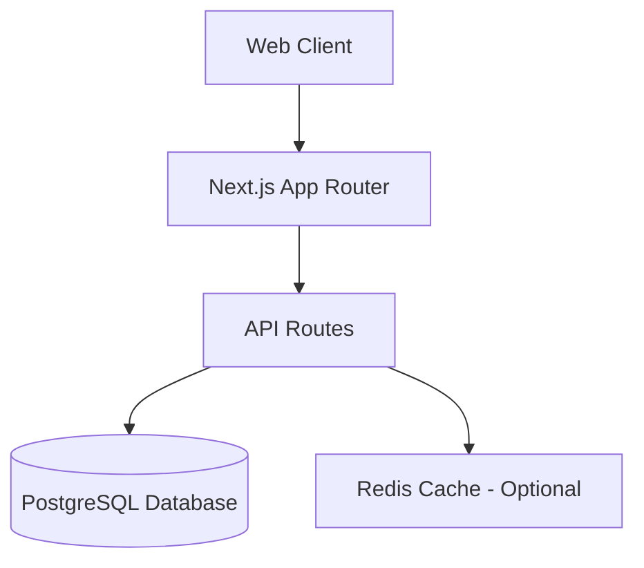
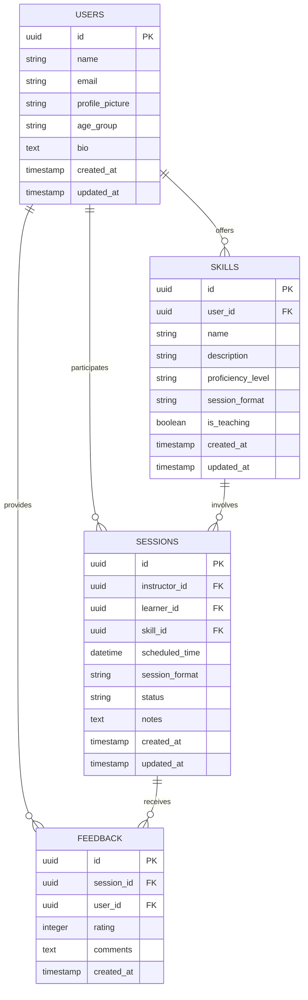
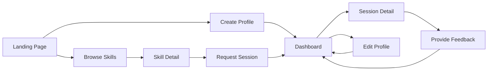

# SkillBridge Technical Specification

## Architecture Overview

### System Architecture


### Tech Stack Justification
- **Frontend**: Next.js with App Router + React + TypeScript
  - Provides server-side rendering for performance
  - TypeScript for type safety and developer experience
  - App Router for file-based routing simplicity
- **Styling**: TailwindCSS with shadcn/ui components
  - Rapid UI development with consistent design system
  - Responsive by default
- **Backend**: Next.js API Routes
  - Unified codebase with frontend
  - Simplified deployment
- **Database**: PostgreSQL
  - Relational database for complex relationships between users and skills
  - Strong data integrity
- **Caching**: Redis (optional enhancement if time permits)
  - Session caching
  - Rate limiting

### Deployment
- Vercel for Next.js application hosting
  - Zero configuration deployment
  - Automatic preview builds for PR review
  - Edge network for global performance

## Database Schema

### ER Diagram


### SQL Table Definitions

```sql
-- Users Table
CREATE TABLE users (
    id UUID PRIMARY KEY DEFAULT gen_random_uuid(),
    name VARCHAR(255) NOT NULL,
    email VARCHAR(255) UNIQUE NOT NULL,
    profile_picture VARCHAR(255),
    age_group VARCHAR(50) NOT NULL,
    bio TEXT,
    created_at TIMESTAMP WITH TIME ZONE DEFAULT CURRENT_TIMESTAMP,
    updated_at TIMESTAMP WITH TIME ZONE DEFAULT CURRENT_TIMESTAMP
);

-- Skills Table
CREATE TABLE skills (
    id UUID PRIMARY KEY DEFAULT gen_random_uuid(),
    user_id UUID NOT NULL REFERENCES users(id) ON DELETE CASCADE,
    name VARCHAR(255) NOT NULL,
    description TEXT NOT NULL,
    proficiency_level VARCHAR(50) NOT NULL,
    session_format VARCHAR(50) NOT NULL,
    is_teaching BOOLEAN NOT NULL,
    created_at TIMESTAMP WITH TIME ZONE DEFAULT CURRENT_TIMESTAMP,
    updated_at TIMESTAMP WITH TIME ZONE DEFAULT CURRENT_TIMESTAMP
);

-- Sessions Table
CREATE TABLE sessions (
    id UUID PRIMARY KEY DEFAULT gen_random_uuid(),
    instructor_id UUID NOT NULL REFERENCES users(id) ON DELETE CASCADE,
    learner_id UUID NOT NULL REFERENCES users(id) ON DELETE CASCADE,
    skill_id UUID NOT NULL REFERENCES skills(id) ON DELETE CASCADE,
    scheduled_time TIMESTAMP WITH TIME ZONE NOT NULL,
    session_format VARCHAR(50) NOT NULL,
    status VARCHAR(50) NOT NULL DEFAULT 'pending',
    notes TEXT,
    created_at TIMESTAMP WITH TIME ZONE DEFAULT CURRENT_TIMESTAMP,
    updated_at TIMESTAMP WITH TIME ZONE DEFAULT CURRENT_TIMESTAMP,
    CONSTRAINT different_users CHECK (instructor_id != learner_id)
);

-- Feedback Table
CREATE TABLE feedback (
    id UUID PRIMARY KEY DEFAULT gen_random_uuid(),
    session_id UUID NOT NULL REFERENCES sessions(id) ON DELETE CASCADE,
    user_id UUID NOT NULL REFERENCES users(id) ON DELETE CASCADE,
    rating INTEGER NOT NULL CHECK (rating BETWEEN 1 AND 5),
    comments TEXT,
    created_at TIMESTAMP WITH TIME ZONE DEFAULT CURRENT_TIMESTAMP
);

-- Indexes
CREATE INDEX idx_skills_user_id ON skills(user_id);
CREATE INDEX idx_sessions_instructor_id ON sessions(instructor_id);
CREATE INDEX idx_sessions_learner_id ON sessions(learner_id);
CREATE INDEX idx_sessions_skill_id ON sessions(skill_id);
CREATE INDEX idx_feedback_session_id ON feedback(session_id);
CREATE INDEX idx_feedback_user_id ON feedback(user_id);
```

## Feature Specifications

### Feature 1: User Profile Management

#### Goal
Enable users to create and manage their profiles with personal details, skills they can teach, and skills they want to learn.

#### API Relationships
- `/api/users` - CRUD operations for user profiles
- `/api/skills` - CRUD operations for user skills (teaching and learning)

#### Detailed Requirements

##### Requirement A: Profile Creation
- Allow users to create profiles with name, email, age group, bio, and profile picture
- Support uploading and cropping profile images
- Enable users to specify skills they can teach and skills they want to learn
- Validate all required fields before submission

##### Requirement B: Profile Editing
- Allow users to update all profile fields
- Provide immediate feedback on successful changes
- Enable adding, editing, and removing skills
- Preserve existing profile picture if no new one is uploaded

##### Requirement C: Profile Validation
- Ensure email format is valid
- Require name field (minimum 2 characters)
- Validate age group selection from predefined options
- Limit bio text to 500 characters

#### Implementation Guide

##### Data Flow Steps
1. User enters profile information in the UI form
2. Client validates all required fields and formats
3. Form data is sent to `/api/users` endpoint
4. Server validates the data and creates database record
5. Skills data is processed and stored in the skills table
6. Response with success/error is returned to client
7. UI updates to show success state or validation errors

##### Pseudocode for Profile Creation

```
function handleProfileSubmit(formData) {
  // Client-side validation
  if (!validateRequiredFields(formData)) {
    showErrors();
    return;
  }
  
  // Set loading state
  setIsLoading(true);
  
  try {
    // Process image if provided
    let imageUrl = null;
    if (formData.profileImage) {
      imageUrl = await uploadAndProcessImage(formData.profileImage);
    }
    
    // Create user record
    const userData = {
      name: formData.name,
      email: formData.email,
      age_group: formData.ageGroup,
      bio: formData.bio,
      profile_picture: imageUrl
    };
    
    const response = await fetch('/api/users', {
      method: 'POST',
      headers: { 'Content-Type': 'application/json' },
      body: JSON.stringify(userData)
    });
    
    if (!response.ok) {
      throw new Error('Failed to create profile');
    }
    
    const user = await response.json();
    
    // Create skills records
    await Promise.all([
      ...formData.teachingSkills.map(skill => 
        createSkill({ ...skill, user_id: user.id, is_teaching: true })
      ),
      ...formData.learningSkills.map(skill => 
        createSkill({ ...skill, user_id: user.id, is_teaching: false })
      )
    ]);
    
    // Show success state
    showSuccessMessage();
    redirectToDashboard();
  } catch (error) {
    // Handle errors
    showErrorMessage(error.message);
  } finally {
    setIsLoading(false);
  }
}
```

##### Key Edge Cases
- Handling duplicate email addresses
- Managing failed image uploads
- Dealing with connection interruptions during multi-step creation
- Ensuring data consistency if some skill creations fail

### Feature 2: Skill Discovery and Matching

#### Goal
Allow users to browse and search for skills taught by others and request learning sessions based on matches.

#### API Relationships
- `/api/skills` - Get available skills with filtering options
- `/api/skills/search` - Search skills by name, category, format, etc.
- `/api/skills/[id]` - Get detailed information about a specific skill

#### Detailed Requirements

##### Requirement A: Browse Skills
- Display a paginated grid of available skills
- Include essential information: skill name, instructor, proficiency level, format
- Support filtering by skill category, session format, and instructor age group
- Enable text search across skill names and descriptions

##### Requirement B: Skill Details
- Show comprehensive skill information
- Display instructor profile summary
- Show availability calendar for possible session times
- Provide a clear call-to-action for requesting a session

##### Requirement C: Search & Filter
- Implement real-time search with debounced input
- Apply multiple filters simultaneously
- Show active filters with ability to remove individual filters
- Provide empty state when no skills match criteria

#### Implementation Guide

##### Data Flow Steps
1. User navigates to browse skills page
2. Client requests initial set of skills from API
3. User can apply filters or search terms
4. Client sends updated query parameters to API
5. API returns filtered results
6. Client renders updated skill cards
7. User selects skill to view details
8. Client requests detailed skill information
9. API returns skill details with instructor information and availability
10. Client renders detailed view with session request option

##### Pseudocode for Skill Filtering

```
// Client-side filter handling
function handleFiltersChange(newFilters) {
  setFilters(newFilters);
  
  // Build query string from filters
  const queryParams = new URLSearchParams();
  
  if (newFilters.category) {
    queryParams.append('category', newFilters.category);
  }
  
  if (newFilters.format) {
    queryParams.append('format', newFilters.format);
  }
  
  if (newFilters.ageGroup) {
    queryParams.append('ageGroup', newFilters.ageGroup);
  }
  
  if (newFilters.searchTerm) {
    queryParams.append('search', newFilters.searchTerm);
  }
  
  // Update URL with new filters
  router.push(`/skills?${queryParams.toString()}`, undefined, { scroll: false });
  
  // Fetch filtered results
  fetchSkills(queryParams);
}

// API handler for skills listing
async function getSkills(req, res) {
  try {
    const { 
      category, 
      format, 
      ageGroup, 
      search,
      page = 1,
      limit = 12
    } = req.query;
    
    // Build database query
    let query = prisma.skills.findMany({
      where: {
        is_teaching: true,
        // Apply filters if provided
        ...(category && { category: category }),
        ...(format && { session_format: format }),
        ...(search && {
          OR: [
            { name: { contains: search, mode: 'insensitive' } },
            { description: { contains: search, mode: 'insensitive' } }
          ]
        })
      },
      include: {
        user: {
          select: {
            id: true,
            name: true,
            age_group: true,
            profile_picture: true
          }
        }
      },
      // Filter by age group of instructor if provided
      ...(ageGroup && {
        user: {
          age_group: ageGroup
        }
      }),
      // Pagination
      skip: (page - 1) * limit,
      take: limit
    });
    
    const [skills, total] = await Promise.all([
      query,
      prisma.skills.count({ where: query.where }) // Get total for pagination
    ]);
    
    return res.status(200).json({
      skills,
      pagination: {
        total,
        pages: Math.ceil(total / limit),
        page: Number(page),
        limit: Number(limit)
      }
    });
  } catch (error) {
    return res.status(500).json({ error: 'Failed to fetch skills' });
  }
}
```

##### Key Edge Cases
- Handling no results for specific filter combinations
- Managing large result sets with pagination
- Dealing with slow network connections during filter updates
- Maintaining filter state during navigation and page refreshes

### Feature 3: Session Management

#### Goal
Enable users to request, schedule, and manage learning sessions with instructors.

#### API Relationships
- `/api/sessions` - CRUD operations for session management
- `/api/sessions/[id]` - Get, update or delete specific session
- `/api/users/[id]/availability` - Check instructor availability

#### Detailed Requirements

##### Requirement A: Session Requests
- Allow learners to request sessions for specific skills
- Enable selection of preferred date/time slots
- Support both virtual and in-person session formats
- Include optional notes field for special requests

##### Requirement B: Session Dashboard
- Provide a unified view of all upcoming and past sessions
- Distinguish between teaching and learning sessions
- Show session status (pending, confirmed, completed, canceled)
- Enable actions appropriate to session status (confirm, reschedule, cancel)

##### Requirement C: Session Status Updates
- Allow instructors to accept, reschedule, or decline session requests
- Notify users of status changes
- Enable both participants to cancel sessions
- Mark sessions as completed after scheduled time

#### Implementation Guide

##### Data Flow Steps
1. User selects a skill and requests a session
2. Client sends session request to API with preferred times
3. Server creates session record with "pending" status
4. Instructor is notified of pending request
5. Instructor accepts, reschedules, or declines request
6. API updates session status accordingly
7. Learner is notified of status change
8. Both users can view and manage session in dashboard

##### Pseudocode for Session Request

```
// Client-side session request
async function handleSessionRequest(skillId, formData) {
  try {
    setIsLoading(true);
    
    // Get current user info
    const currentUser = await getCurrentUser();
    
    // Get skill info to verify instructor
    const skillDetails = await fetch(`/api/skills/${skillId}`).then(res => res.json());
    
    // Create session request
    const sessionData = {
      skill_id: skillId,
      instructor_id: skillDetails.user_id,
      learner_id: currentUser.id,
      scheduled_time: formData.selectedDateTime,
      session_format: formData.sessionFormat,
      notes: formData.notes || null,
      status: 'pending'
    };
    
    const response = await fetch('/api/sessions', {
      method: 'POST',
      headers: { 'Content-Type': 'application/json' },
      body: JSON.stringify(sessionData)
    });
    
    if (!response.ok) {
      throw new Error('Failed to request session');
    }
    
    // Show success message
    showSuccessMessage('Session requested successfully');
    
    // Redirect to dashboard
    router.push('/dashboard');
  } catch (error) {
    showErrorMessage(error.message);
  } finally {
    setIsLoading(false);
  }
}

// API handler for session creation
async function createSession(req, res) {
  try {
    const { 
      skill_id, 
      instructor_id, 
      learner_id, 
      scheduled_time, 
      session_format, 
      notes 
    } = req.body;
    
    // Validate that instructor and learner exist
    const [instructor, learner, skill] = await Promise.all([
      prisma.users.findUnique({ where: { id: instructor_id } }),
      prisma.users.findUnique({ where: { id: learner_id } }),
      prisma.skills.findUnique({ where: { id: skill_id } })
    ]);
    
    if (!instructor || !learner || !skill) {
      return res.status(404).json({ error: 'Invalid user or skill' });
    }
    
    // Validate that instructor owns the skill
    if (skill.user_id !== instructor_id) {
      return res.status(400).json({ error: 'Invalid instructor for this skill' });
    }
    
    // Create session
    const session = await prisma.sessions.create({
      data: {
        instructor_id,
        learner_id,
        skill_id,
        scheduled_time,
        session_format,
        notes,
        status: 'pending'
      }
    });
    
    return res.status(201).json(session);
  } catch (error) {
    return res.status(500).json({ error: 'Failed to create session' });
  }
}
```

##### Pseudocode for Session Dashboard

```
// Client-side dashboard data fetching
async function fetchDashboardData() {
  try {
    setIsLoading(true);
    
    // Get current user
    const currentUser = await getCurrentUser();
    
    // Fetch sessions where user is either instructor or learner
    const response = await fetch(`/api/users/${currentUser.id}/sessions`);
    
    if (!response.ok) {
      throw new Error('Failed to fetch sessions');
    }
    
    const sessions = await response.json();
    
    // Organize sessions by role and status
    const teachingSessions = sessions.filter(s => s.instructor_id === currentUser.id);
    const learningSessions = sessions.filter(s => s.learner_id === currentUser.id);
    
    const upcomingSessions = [
      ...teachingSessions.filter(s => new Date(s.scheduled_time) > new Date()),
      ...learningSessions.filter(s => new Date(s.scheduled_time) > new Date())
    ].sort((a, b) => new Date(a.scheduled_time) - new Date(b.scheduled_time));
    
    const pastSessions = [
      ...teachingSessions.filter(s => new Date(s.scheduled_time) <= new Date()),
      ...learningSessions.filter(s => new Date(s.scheduled_time) <= new Date())
    ].sort((a, b) => new Date(b.scheduled_time) - new Date(a.scheduled_time));
    
    // Update state with organized sessions
    setSessionData({
      teaching: teachingSessions,
      learning: learningSessions,
      upcoming: upcomingSessions,
      past: pastSessions
    });
  } catch (error) {
    showErrorMessage(error.message);
  } finally {
    setIsLoading(false);
  }
}
```

##### Key Edge Cases
- Handling timezone differences for virtual sessions
- Managing session conflicts when instructor accepts multiple requests
- Dealing with last-minute cancellations
- Handling no-shows (sessions neither canceled nor completed)

### Feature 4: Feedback and Analytics

#### Goal
Enable users to provide feedback after sessions and view personal impact metrics.

#### API Relationships
- `/api/feedback` - Create and retrieve session feedback
- `/api/users/[id]/metrics` - Get user impact metrics and statistics
- `/api/feedback/[session_id]` - Get feedback for a specific session

#### Detailed Requirements

##### Requirement A: Session Feedback
- Allow both participants to rate sessions after completion
- Include numerical rating (1-5 stars) and optional comments
- Show appropriate feedback form once a session is marked complete
- Prevent duplicate feedback submissions

##### Requirement B: Personal Impact Dashboard
- Display visual metrics of user activity
- Show counts of skills taught/learned
- Present session statistics (completed, upcoming, average rating)
- Visualize community impact over time

##### Requirement C: Achievement Tracking
- Track user milestones (first session, 5 sessions, etc.)
- Display badges or achievements for reaching milestones
- Show progress towards upcoming achievements

#### Implementation Guide

##### Data Flow Steps
1. After a session is completed, both users can access feedback form
2. User submits rating and optional comments
3. API stores feedback in database
4. System updates metrics based on new feedback
5. Dashboard displays updated metrics and achievements
6. User can filter metrics by time period or category

##### Pseudocode for Feedback Submission

```
// Client-side feedback submission
async function handleFeedbackSubmit(sessionId, formData) {
  try {
    setIsLoading(true);
    
    // Get current user
    const currentUser = await getCurrentUser();
    
    // Check if user already submitted feedback
    const existingFeedback = await fetch(`/api/feedback?sessionId=${sessionId}&userId=${currentUser.id}`)
      .then(res => res.json());
    
    if (existingFeedback.length > 0) {
      throw new Error('You have already submitted feedback for this session');
    }
    
    // Submit feedback
    const feedbackData = {
      session_id: sessionId,
      user_id: currentUser.id,
      rating: formData.rating,
      comments: formData.comments || null
    };
    
    const response = await fetch('/api/feedback', {
      method: 'POST',
      headers: { 'Content-Type': 'application/json' },
      body: JSON.stringify(feedbackData)
    });
    
    if (!response.ok) {
      throw new Error('Failed to submit feedback');
    }
    
    // Show success message
    showSuccessMessage('Feedback submitted successfully');
    
    // Refresh dashboard data
    fetchDashboardData();
  } catch (error) {
    showErrorMessage(error.message);
  } finally {
    setIsLoading(false);
  }
}

// API handler for metrics
async function getUserMetrics(req, res) {
  try {
    const { userId } = req.query;
    const { timeRange } = req.query; // 'week', 'month', 'all'
    
    // Define date range based on timeRange
    let dateFilter = {};
    const now = new Date();
    
    if (timeRange === 'week') {
      const weekAgo = new Date(now);
      weekAgo.setDate(now.getDate() - 7);
      dateFilter = {
        scheduled_time: {
          gte: weekAgo
        }
      };
    } else if (timeRange === 'month') {
      const monthAgo = new Date(now);
      monthAgo.setMonth(now.getMonth() - 1);
      dateFilter = {
        scheduled_time: {
          gte: monthAgo
        }
      };
    }
    
    // Get sessions taught
    const taughtSessions = await prisma.sessions.count({
      where: {
        instructor_id: userId,
        status: 'completed',
        ...dateFilter
      }
    });
    
    // Get sessions learned
    const learnedSessions = await prisma.sessions.count({
      where: {
        learner_id: userId,
        status: 'completed',
        ...dateFilter
      }
    });
    
    // Get average rating for taught sessions
    const taughtRatings = await prisma.feedback.findMany({
      where: {
        session: {
          instructor_id: userId,
          status: 'completed',
          ...dateFilter
        }
      },
      select: {
        rating: true
      }
    });
    
    const avgTaughtRating = taughtRatings.length > 0
      ? taughtRatings.reduce((sum, item) => sum + item.rating, 0) / taughtRatings.length
      : 0;
    
    // Get average rating for learned sessions
    const learnedRatings = await prisma.feedback.findMany({
      where: {
        session: {
          learner_id: userId,
          status: 'completed',
          ...dateFilter
        }
      },
      select: {
        rating: true
      }
    });
    
    const avgLearnedRating = learnedRatings.length > 0
      ? learnedRatings.reduce((sum, item) => sum + item.rating, 0) / learnedRatings.length
      : 0;
    
    // Get upcoming sessions
    const upcomingSessions = await prisma.sessions.count({
      where: {
        OR: [
          { instructor_id: userId },
          { learner_id: userId }
        ],
        status: 'confirmed',
        scheduled_time: {
          gt: new Date()
        }
      }
    });
    
    // Calculate achievements
    const totalSessions = taughtSessions + learnedSessions;
    const achievements = [
      { name: 'First Session', earned: totalSessions >= 1 },
      { name: 'Skill Sharer', earned: taughtSessions >= 5 },
      { name: 'Lifelong Learner', earned: learnedSessions >= 5 },
      { name: 'Community Pillar', earned: totalSessions >= 10 }
    ];
    
    return res.status(200).json({
      sessions: {
        taught: taughtSessions,
        learned: learnedSessions,
        upcoming: upcomingSessions,
        total: totalSessions
      },
      ratings: {
        avgTaught: avgTaughtRating,
        avgLearned: avgLearnedRating
      },
      achievements
    });
  } catch (error) {
    return res.status(500).json({ error: 'Failed to fetch metrics' });
  }
}
```

##### Key Edge Cases
- Handling users with no completed sessions
- Managing feedback for canceled sessions
- Dealing with potential rating abuse
- Ensuring data consistency for metrics calculations

## Frontend Structure

### Page Layout

#### 1. Landing Page (`/`)
- Introduction to SkillBridge concept
- Key benefits and features
- Call to action to create profile
- **Endpoints Used**: None (static content)
- **Components**:
  - Hero
  - FeatureHighlights
  - HowItWorks
  - Testimonials
  - CTAButton

#### 2. Profile Creation/Edit (`/profile/[create|edit]`)
- Multi-step form for creating/editing profile
- **Endpoints Used**: 
  - `/api/users` (POST/PUT)
  - `/api/skills` (POST/PUT/DELETE)
- **Components**:
  - ProfileForm
  - SkillsFormSection
  - ImageUploader
  - FormNavigation

#### 3. Browse Skills (`/skills`)
- Grid of available skills with filters
- **Endpoints Used**: 
  - `/api/skills` (GET with query params)
- **Components**:
  - SkillsGrid
  - SkillCard
  - FilterBar
  - SearchInput
  - Pagination

#### 4. Skill Detail (`/skills/[id]`)
- Detailed view of a specific skill
- Session request interface
- **Endpoints Used**: 
  - `/api/skills/[id]` (GET)
  - `/api/users/[id]/availability` (GET)
  - `/api/sessions` (POST)
- **Components**:
  - SkillDetailHeader
  - InstructorCard
  - AvailabilityCalendar
  - SessionRequestForm

#### 5. Dashboard (`/dashboard`)
- Overview of user's sessions and activities
- **Endpoints Used**: 
  - `/api/users/[id]/sessions` (GET)
  - `/api/users/[id]/metrics` (GET)
- **Components**:
  - DashboardHeader
  - SessionsList
  - MetricsPanel
  - AchievementBadges

#### 6. Session Detail (`/sessions/[id]`)
- Detailed view of a specific session
- Status management controls
- Feedback interface
- **Endpoints Used**: 
  - `/api/sessions/[id]` (GET/PUT)
  - `/api/feedback` (POST)
  - `/api/feedback/[session_id]` (GET)
- **Components**:
  - SessionHeader
  - SessionActions
  - FeedbackForm
  - FeedbackDisplay

### State Management

- Use React Context for global state (current user, theme)
- Use React Query for server state management
  - Caching
  - Optimistic updates
  - Refetch on window focus
- Local component state for form inputs and UI state

### Navigation Flow



## Testing

### Unit Tests

#### User Profile Management
- Test validation rules for profile creation
- Test handling of profile image uploads
- Test skill addition and removal

#### Skill Discovery
- Test search functionality with various terms
- Test filter combinations for expected results
- Test pagination behavior

#### Session Management
- Test session creation with valid/invalid data
- Test session status transitions
- Test availability checking logic

#### Feedback System
- Test feedback submission validation
- Test metrics calculations
- Test achievement unlocking logic

### E2E Tests

#### Test Case 1: Complete User Journey
1. Visit the landing page
2. Create a new profile with teaching and learning skills
3. Browse skills and apply filters
4. View a skill detail page
5. Request a session
6. Navigate to dashboard and view pending session
7. Update session status (as both instructor and learner)
8. Complete session and provide feedback
9. Verify metrics update in dashboard

#### Test Case 2: Profile Management
1. Create initial profile
2. Edit profile information
3. Add new skills to teach/learn
4. Remove existing skills
5. Verify changes are reflected everywhere

#### Test Case 3: Session Workflow
1. Create two user profiles (instructor and learner)
2. Learner requests session with instructor
3. Instructor accepts session
4. Test rescheduling flow
5. Complete session
6. Both users provide feedback
7. Verify metrics are updated for both users

## Data Management

### Data Lifecycle
1. User creates profile with personal information and skills
2. Skills become discoverable in the browse interface
3. Sessions are created linking users and skills
4. Session status changes over time (pending → confirmed → completed)
5. Feedback is provided after session completion
6. Metrics are calculated based on sessions and feedback

### Performance Considerations
- Implement pagination for skills browse and dashboard views
- Use database indexes for common query patterns
- Consider Redis caching for frequently accessed data if time permits
  - User profiles
  - Skills listings
  - Dashboard metrics

### Security Considerations
- No authentication required per hackathon rules
- Implement basic input validation on all endpoints
- Use UUIDs for database records to prevent enumeration attacks 